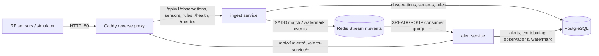
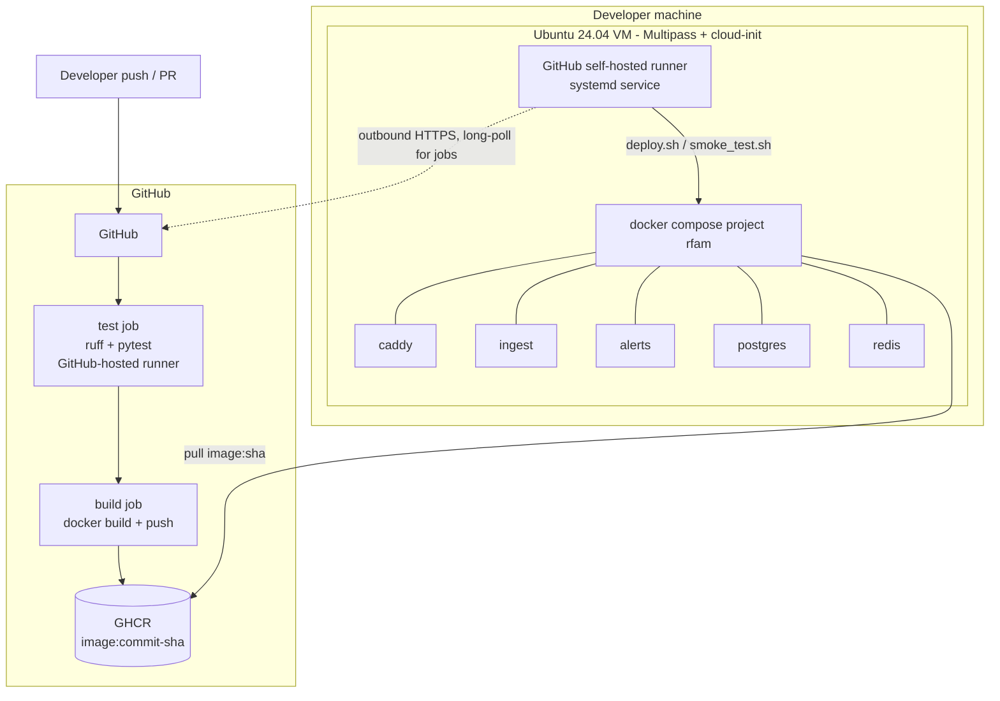

# Architecture

## Components

| Component | Responsibility |
|---|---|
| **Caddy** | Single public entry point (port 80). Routes each path to the service that owns it. |
| **ingest service** | Validates and stores observations, tracks sensors, owns rules (CRUD + YAML loading), runs the rule engine, publishes events. |
| **Redis Streams** | Asynchronous, persistent (AOF) message log between the services. Consumer group gives at-least-once delivery. |
| **alert service** | Consumes events, deduplicates, opens / updates / auto-resolves alerts, serves the alert API. |
| **PostgreSQL** | One instance, but each service owns its own tables and never reads the other's. |

Both services are built from the same image; `SERVICE=ingest|alerts` selects the app.

## Data flow

1. A sensor POSTs one observation or a batch. Each item is validated; valid items are
   stored, invalid ones are reported back by index.
2. The rule engine evaluates the valid observations against enabled rules:
   - **power_threshold**: in band and above `threshold_dbm`. Matching observations are
     kept as *pending* per (rule, signal). Only when the pending condition spans
     `min_duration_s` of event time is it *confirmed*; then all pending observations are
     emitted as one `match` event, and every later matching observation is emitted
     immediately. A gap longer than `max_gap_s` while pending resets the condition, so
     short bursts never add up to an alert.
   - **multi_sensor**: in band and above `min_power_dbm`; a `match` is emitted when at
     least `min_sensors` distinct sensors reported a frequency within
     `frequency_tolerance_khz` inside `window_s` seconds.
3. After every request the engine also emits a `watermark` event: the highest event time
   seen so far.
4. The alert service applies each `match`:
   - If an OPEN or ACKNOWLEDGED alert exists for the same rule and signal, it is updated
     (occurrences, first/last seen, peak power, sensors). Acknowledging does not stop this.
   - If the observation is older than the moment the last alert for that signal was
     resolved, it is a late observation: it is attached to that resolved alert, which
     stays resolved.
   - Otherwise a new OPEN alert is created.
   Observations are linked to alerts by id, so a redelivered message or overlapping
   multi_sensor groups never count twice.
5. On each `watermark`, alerts whose `last_seen + resolve_after_s` is earlier than the
   watermark are auto-resolved.

"Same signal" = same rule and the same frequency bucket
(`round(freq_khz / frequency_tolerance_khz)`).

## Data model

**Ingest service**

| Table | Key columns |
|---|---|
| `observations` | id (uuid), sensor_id, timestamp, frequency_mhz, bandwidth_khz, power_dbm, lat, lon, received_at. Indexes on (sensor_id, timestamp), timestamp, frequency_mhz. |
| `sensors` | sensor_id, last_seen (event time), last_received_at (arrival time), last location, observation_count |
| `rules` | rule_id, data (validated rule as JSON), updated_at |

**Alert service**

| Table | Key columns |
|---|---|
| `alerts` | alert_id, rule_id, signal_key, state, severity, frequency_mhz, sensor_ids, first_seen, last_seen, occurrences, peak_power_dbm, resolve_after_s, acknowledged_at, resolved_at, resolved_event_time, resolution (auto/manual) |
| `alert_observations` | (alert_id, observation_id) primary key + a copy of the observation fields |
| `alert_service_state` | the persisted event-time watermark |

## Deployment topology

- The VM only accepts SSH (22) and HTTP (80) (ufw). Only Caddy publishes a port.
- Docker and the runner are systemd services, and all containers use
  `restart: unless-stopped`, so everything comes back after a VM reboot.
- Container logs are capped at 3 × 10 MB per container, the journal at 200 MB.
- PostgreSQL and Redis data live in named volumes (`rfam_pgdata`, `rfam_redisdata`).
